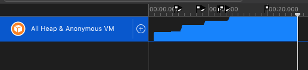

# realm-memory-leak
Minimal example that reproduces a memory leak in realm.

## How to build
Run `carthage update --platform ios` before opening the the `realm-memory-leak.xcodeproj`.

## How to reproduce the leak
Build and profile via instruments (e.g. zombies) the app's memory usage. On each open of the app, multiple realm instances are created in loop, to make the leak visible.



```swift
    func applicationWillEnterForeground(_ application: UIApplication) {
        // Called as part of the transition from the background to the active state; here you can undo many of the changes made on entering the background.
        
        for _ in 0..<400 {
            autoreleasepool {
                _ = try! Realm(configuration: Realm.Configuration(objectTypes: []))
            }
        }
    }
```
